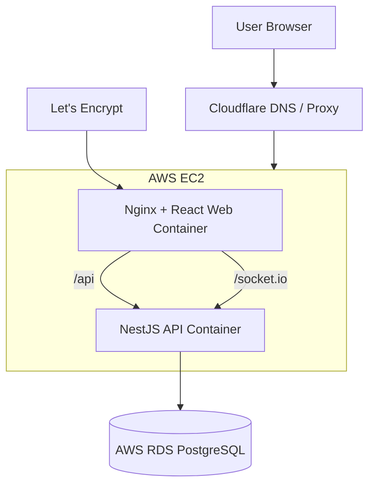
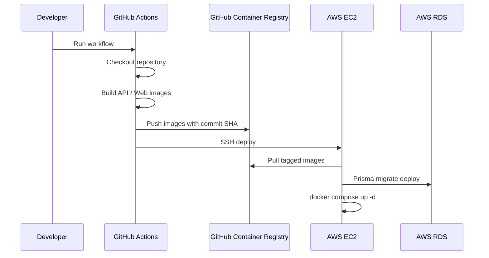

# Chat AI Agent

<p align="center">
  <strong>NestJS + React 기반 AI 채팅 에이전트 웹 애플리케이션</strong>
</p>

<p align="center">
  <a href="https://woohyuk.dev">https://woohyuk.dev</a> ·
  <a href="https://www.woohyuk.dev">https://www.woohyuk.dev</a>
</p>

<p align="center">
  
  
  
  
  
  
  
  
</p>

---

## 목차

- [프로젝트 소개](#프로젝트-소개)
- [기술 스택](#기술-스택)
- [아키텍처](#아키텍처)
- [프로젝트 구조](#프로젝트-구조)
- [배포 구조](#배포-구조)
- [환경 변수](#환경-변수)
- [로컬 개발](#로컬-개발)
- [운영 배포](#운영-배포)
- [배포 검증](#배포-검증)
- [HTTPS / 도메인](#https--도메인)
- [트러블슈팅](#트러블슈팅)
- [향후 개선 사항](#향후-개선-사항)

---

## 프로젝트 소개

`Chat AI Agent`는 React Web과 NestJS API로 구성된 AI 채팅 에이전트 웹 애플리케이션입니다.

Monorepo 구조에서 프론트엔드, 백엔드, 공통 패키지를 함께 관리하며, 운영 환경에서는 Docker Compose 기반으로 AWS EC2에 배포됩니다.

주요 목표는 다음과 같습니다.

- React 기반 웹 클라이언트 제공
- NestJS 기반 API 서버 제공
- Prisma를 통한 PostgreSQL 데이터베이스 관리
- Socket.IO 기반 실시간 통신 경로 지원
- GitHub Actions 기반 자동 배포
- GHCR 기반 이미지 태그 배포
- Cloudflare DNS + Let’s Encrypt 기반 HTTPS 적용

---

## 기술 스택

| 영역 | 기술 |
|---|---|
| Frontend | React, TypeScript, Vite |
| Backend | NestJS, TypeScript, Prisma, JWT |
| Realtime | Socket.IO |
| Database | PostgreSQL, AWS RDS |
| Infra | Docker, Docker Compose, Nginx |
| CI/CD | GitHub Actions, GitHub Container Registry |
| Cloud | AWS EC2, AWS RDS |
| DNS / HTTPS | Cloudflare, Let’s Encrypt |

---

## 아키텍처



### 요청 흐름

```txt
사용자
  ↓
Cloudflare
  ↓
EC2 80/443
  ↓
Nginx Web Container
  ├── React 정적 파일 제공
  ├── /api/ → NestJS API Container
  └── /socket.io/ → NestJS WebSocket
  ↓
AWS RDS PostgreSQL
```

---

## 프로젝트 구조

```txt
chat-ai-agent/
├── apps/
│   ├── api/
│   │   ├── Dockerfile
│   │   └── src/
│   └── web/
│       ├── Dockerfile
│       ├── nginx.conf
│       └── src/
├── packages/
│   └── shared/
├── prisma/
│   ├── schema.prisma
│   └── migrations/
├── docker-compose.ec2.yml
├── pnpm-workspace.yaml
├── package.json
└── .github/
    └── workflows/
        └── deploy.yml
```

---

## 배포 구조

현재 배포는 GitHub Actions에서 이미지를 빌드한 뒤 GHCR에 push하고, EC2에서 해당 이미지를 pull하여 실행하는 방식입니다.



이미지 태그는 Git commit SHA를 사용합니다.

```txt
ghcr.io/itwoo/chat-ai-agent-api:<commit-sha>
ghcr.io/itwoo/chat-ai-agent-web:<commit-sha>
```

이 방식의 장점은 다음과 같습니다.

- 어떤 커밋이 배포되었는지 추적 가능
- 이미지 태그 기반 배포로 기존 컨테이너 갱신 여부 확인 가능
- EC2에서는 이미지를 빌드하지 않고 pull 후 실행
- 롤백 시 이전 이미지 태그를 기준으로 되돌릴 수 있음

---

## Docker Compose 운영 설정

`docker-compose.ec2.yml`은 EC2에서 이미지를 빌드하지 않고 GHCR 이미지를 실행합니다.

```yaml
services:
  api:
    image: ghcr.io/itwoo/chat-ai-agent-api:${IMAGE_TAG}
    container_name: chat-ai-agent-api
    env_file:
      - /home/ec2-user/env/chat-ai-agent-api.env
    expose:
      - "3000"
    restart: unless-stopped

  web:
    image: ghcr.io/itwoo/chat-ai-agent-web:${IMAGE_TAG}
    container_name: chat-ai-agent-web
    ports:
      - "80:80"
      - "443:443"
    volumes:
      - /var/www/certbot:/var/www/certbot
      - /etc/letsencrypt:/etc/letsencrypt:ro
    depends_on:
      - api
    restart: unless-stopped
```

---

## Nginx 역할

`apps/web/nginx.conf`는 다음 역할을 담당합니다.

- React 정적 파일 제공
- HTTP → HTTPS 리다이렉트
- `/api/` 요청을 NestJS API 컨테이너로 프록시
- `/socket.io/` 요청을 WebSocket 서버로 프록시
- Let’s Encrypt 인증서 갱신용 challenge 경로 제공

주요 프록시 설정 예시:

```nginx
location /api/ {
  proxy_pass http://api:3000;
  proxy_http_version 1.1;

  proxy_set_header Host $host;
  proxy_set_header X-Real-IP $remote_addr;
  proxy_set_header X-Forwarded-For $proxy_add_x_forwarded_for;
  proxy_set_header X-Forwarded-Proto $scheme;
}

location /socket.io/ {
  proxy_pass http://api:3000;
  proxy_http_version 1.1;

  proxy_set_header Upgrade $http_upgrade;
  proxy_set_header Connection $connection_upgrade;

  proxy_set_header Host $host;
  proxy_set_header X-Real-IP $remote_addr;
  proxy_set_header X-Forwarded-For $proxy_add_x_forwarded_for;
  proxy_set_header X-Forwarded-Proto $scheme;

  proxy_read_timeout 86400;
  proxy_send_timeout 86400;
}
```

---

## 환경 변수

API 서버 운영 환경 변수는 EC2 내부 파일로 관리합니다.

```txt
/home/ec2-user/env/chat-ai-agent-api.env
```

예시:

```env
NODE_ENV=production
PORT=3000
DATABASE_URL=postgresql://<user>:<password>@<rds-endpoint>:5432/<database>?schema=public&sslmode=require&uselibpqcompat=true
JWT_SECRET=<jwt-secret>
JWT_EXPIRES_IN=3600
```

> 운영 환경 변수와 시크릿은 Git에 커밋하지 않습니다.

---

## 로컬 개발

패키지 설치:

```bash
pnpm install
```

Prisma Client 생성:

```bash
pnpm --filter api prisma generate
```

개발 서버 실행:

```bash
pnpm --filter api start:dev
pnpm --filter web dev
```

빌드:

```bash
pnpm --filter @repo/shared build
pnpm --filter api build
pnpm --filter web build
```

---

## 운영 배포

배포는 GitHub Actions에서 수동으로 실행합니다.

```txt
GitHub Repository
→ Actions
→ Deploy to EC2
→ Run workflow
```

배포 단계 요약:

1. Repository checkout
2. Docker Buildx 설정
3. GHCR 로그인
4. API 이미지 빌드 및 push
5. Web 이미지 빌드 및 push
6. AWS OIDC 인증
7. GitHub Actions Runner IP를 EC2 보안그룹에 임시 허용
8. EC2 SSH 접속
9. 최신 코드 반영
10. GHCR 이미지 pull
11. Prisma migration 실행
12. Docker Compose up
13. 배포 결과 검증
14. 임시 SSH 보안그룹 규칙 제거

---

## 배포 검증

EC2에서 현재 실행 중인 이미지 확인:

```bash
docker inspect chat-ai-agent-web --format '{{.Config.Image}}'
docker inspect chat-ai-agent-api --format '{{.Config.Image}}'
```

정상 예시:

```txt
ghcr.io/itwoo/chat-ai-agent-web:<commit-sha>
ghcr.io/itwoo/chat-ai-agent-api:<commit-sha>
```

컨테이너 상태 확인:

```bash
docker compose -f docker-compose.ec2.yml ps
```

Nginx 설정 확인:

```bash
docker exec chat-ai-agent-web grep -n "server_name" /etc/nginx/conf.d/default.conf
```

HTTPS 확인:

```bash
curl -I https://woohyuk.dev
curl -I https://www.woohyuk.dev
```

HTTP → HTTPS 리다이렉트 확인:

```bash
curl -I http://woohyuk.dev
curl -I http://www.woohyuk.dev
```

---

## HTTPS / 도메인

사용 도메인:

```txt
woohyuk.dev
www.woohyuk.dev
```

구성:

| 항목 | 내용 |
|---|---|
| DNS | Cloudflare |
| HTTPS 인증서 | Let’s Encrypt |
| 인증서 저장 위치 | `/etc/letsencrypt/live/woohyuk.dev` |
| 웹 서버 | Nginx Container |
| SSL 모드 | Cloudflare Full Strict 권장 |

인증서 볼륨:

```yaml
volumes:
  - /var/www/certbot:/var/www/certbot
  - /etc/letsencrypt:/etc/letsencrypt:ro
```

---

## 인증서 자동 갱신

Let’s Encrypt 인증서는 cron으로 자동 갱신합니다.

갱신 스크립트 예시:

```bash
#!/bin/bash
set -e

docker run --rm \
  -v /etc/letsencrypt:/etc/letsencrypt \
  -v /var/www/certbot:/var/www/certbot \
  certbot/certbot renew

cd /home/ec2-user/projects/chat-ai-agent

docker compose -f docker-compose.ec2.yml exec -T web nginx -t
docker compose -f docker-compose.ec2.yml exec -T web nginx -s reload
```

cron 예시:

```cron
0 4 * * * /home/ec2-user/renew-chat-ai-agent-cert.sh >> /home/ec2-user/renew-chat-ai-agent-cert.log 2>&1
```

---

## 보안 설정

### EC2 Security Group

| Port | Purpose |
|---:|---|
| 80 | HTTP |
| 443 | HTTPS |
| 22 | SSH |

SSH 22번 포트는 GitHub Actions Runner IP만 임시로 허용하고, 배포 후 제거합니다.

### RDS Security Group

| Port | Source |
|---:|---|
| 5432 | EC2 Security Group |

RDS는 `0.0.0.0/0`으로 공개하지 않습니다.

---

## 트러블슈팅

### 1. Nginx 설정이 컨테이너에 반영되지 않던 문제

증상:

```txt
EC2의 apps/web/nginx.conf는 최신이지만
컨테이너 내부 /etc/nginx/conf.d/default.conf는 구버전
```

원인:

```txt
동일한 로컬 이미지 이름을 계속 사용하면서 기존 컨테이너가 새 이미지 기준으로 재생성되지 않음
```

해결:

```txt
GitHub Actions에서 commit SHA 태그로 이미지를 빌드
GHCR에 push
EC2에서는 해당 태그 이미지를 pull
docker compose up -d로 새 이미지 기준 컨테이너 실행
```

---

### 2. `docker compose run` 이후 배포 로그가 끊기던 문제

증상:

```txt
Prisma migration 이후 deploy containers 단계가 실행되지 않음
하지만 GitHub Actions는 성공 처리됨
```

원인:

```txt
SSH heredoc 환경에서 docker compose run이 남은 stdin을 소비
```

해결:

```bash
docker compose -f docker-compose.ec2.yml run -T --rm --no-deps api pnpm exec prisma migrate deploy < /dev/null
```

---

### 3. `docker compose exec` 검증 단계에서 로그가 끊기던 문제

증상:

```txt
docker compose exec 검증 단계 이후 로그가 이어지지 않음
```

해결:

```txt
검증용 명령은 docker compose exec 대신 docker exec 사용
```

예시:

```bash
docker exec chat-ai-agent-web grep -n "server_name" /etc/nginx/conf.d/default.conf
```

---

## 운영 체크리스트

배포 후 아래 항목을 확인합니다.

- [ ] GitHub Actions가 성공했는가?
- [ ] 마지막 로그에 `deploy completed`가 출력되었는가?
- [ ] web 컨테이너 이미지가 `ghcr.io/...:<commit-sha>` 인가?
- [ ] api 컨테이너 이미지가 `ghcr.io/...:<commit-sha>` 인가?
- [ ] Nginx `server_name`에 `woohyuk.dev`와 `www.woohyuk.dev`가 모두 있는가?
- [ ] `https://woohyuk.dev` 접속이 가능한가?
- [ ] `https://www.woohyuk.dev` 접속이 가능한가?
- [ ] HTTP 요청이 HTTPS로 리다이렉트되는가?
- [ ] 회원가입/로그인이 정상 동작하는가?
- [ ] `/api` 요청이 정상 동작하는가?
- [ ] `/socket.io` 연결이 정상 동작하는가?

---

## 향후 개선 사항

- Cloudflare WAF / Rate Limiting 설정
- Nginx rate limit 추가
- GitHub Packages 오래된 이미지 정리 정책 추가
- CloudWatch 비용 / 트래픽 알람 추가
- 배포 실패 시 Slack 또는 Email 알림 추가
- 테스트 자동화 후 배포 전 검증 단계 추가
- Blue-Green 또는 Rolling 배포 구조 검토

---

## License

This project is for personal portfolio and learning purposes.
